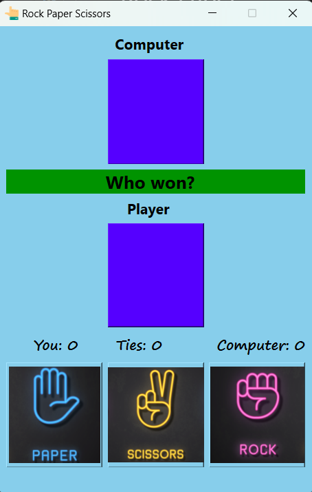

# Rock Paper Scissors

Design by **Qt**

Coding by **Python**

## How work
You have a chance to win, select your choice and see the result.

## GUI 


## Installation
```
pip install pyside6
```

## Usage

If you made some changes in the `mainwindow.ui` file, you need to run the following command:
```
pyside6-uic main_window.ui -o ui_main_window.py
```
You must run `pyside6-uic` again every time you make changes to the UI file.